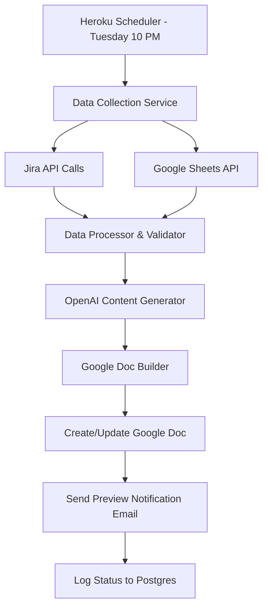
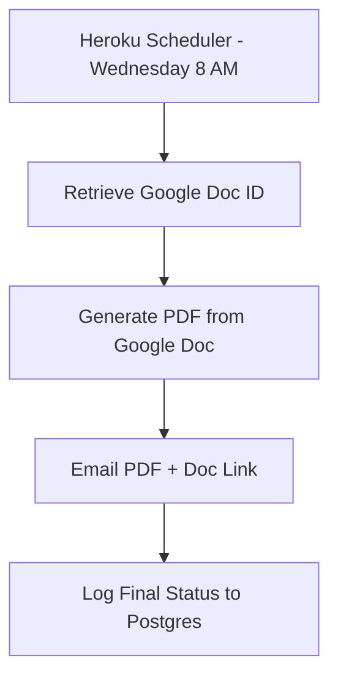

# SmarterProducts-Weekly: Architecture Plan

## Project Overview

An automated weekly reporting system that:
- **Tuesday Night**: Generates Google Doc report for review/editing
- **Wednesday Morning**: Converts Google Doc to PDF and emails with Drive link
- **Data Sources**: Multiple Jira boards, Google Sheets (specific tabs)
- **AI Integration**: OpenAI API for content generation with custom prompts
- **Output**: Editable Google Doc (Tuesday) → PDF report + Google Drive link (Wednesday)

## Workflow Details

### Tuesday Evening (10 PM)
1. **Data Collection**: Pull data from Jira boards and Google Sheets
2. **AI Content Generation**: Use OpenAI to create summaries and insights
3. **Google Doc Creation**: Generate formatted report in Google Docs
4. **Preview Notification**: Email you the Google Doc link for review
5. **State Persistence**: Store document ID for Wednesday's PDF generation

### Wednesday Morning (8 AM)  
1. **Document Retrieval**: Get the Google Doc ID from Tuesday's run
2. **PDF Export**: Convert the Google Doc (with any edits you made) to PDF
3. **Final Distribution**: Email PDF attachment + Google Drive link to recipients
4. **Completion Logging**: Record successful delivery

## Architecture: Heroku-Based Solution

**Stack:**
- **Platform**: Heroku (Python buildpack)
- **Runtime**: Python 3.11+
- **Scheduling**: Heroku Scheduler add-on
- **Database**: Heroku Postgres (for state/logging)
- **Storage**: Google Drive (no local file storage needed)
- **Email**: SendGrid (Heroku add-on) or Gmail API
- **Deployment**: GitHub integration with auto-deploy

**Pros:**
- Simple deployment and scaling
- Built-in scheduling with Heroku Scheduler
- Excellent GitHub integration
- Managed database and add-ons
- Cost-effective for scheduled tasks
- Easy environment variable management

**Cons:**
- Heroku dyno sleep (mitigated by scheduler)
- Limited to Heroku ecosystem
- Potential cold starts

**Architecture Flow:**
```
GitHub Push → Heroku Deploy → Scheduler Trigger → Data Collection → AI Processing → Google Doc Creation (Tue) → PDF Generation & Email (Wed)
```

## Recommended Technology Stack

### Core Technologies
- **Language**: Python 3.11+
- **Framework**: FastAPI (for API endpoints) + Click (for CLI)
- **Task Scheduling**: APScheduler or cloud-native schedulers
- **Document Processing**: ReportLab (PDF) + python-docx (Word)

### Data Integration
- **Jira**: `jira` Python library or REST API calls
- **Google Sheets**: `gspread` + Google Sheets API
- **Google Drive**: `google-api-python-client`
- **OpenAI**: `openai` Python library

### Infrastructure Components
- **Configuration**: Pydantic for settings management
- **Logging**: structlog for structured logging
- **Error Handling**: Sentry for error tracking
- **Secrets**: Heroku Config Vars for environment variables

## Data Flow Architecture

### Tuesday Evening Flow (Preview Generation)


### Wednesday Morning Flow (PDF Distribution)


## Component Breakdown

### 1. Data Collection Service
```python
class DataCollector:
    - collect_jira_data(boards: List[str]) -> Dict
    - collect_sheets_data(sheet_id: str, tabs: List[str]) -> Dict
    - validate_data(data: Dict) -> bool
```

### 2. AI Content Generator
```python
class ContentGenerator:
    - generate_summary(data: Dict, prompt_template: str) -> str
    - generate_insights(metrics: Dict) -> str
    - customize_tone(content: str, style_guide: str) -> str
```

### 3. Document Builder
```python
class DocumentBuilder:
    - create_google_doc(content: Dict, folder_id: str) -> str  # Returns doc_id
    - update_google_doc(doc_id: str, content: Dict) -> bool
    - export_doc_as_pdf(doc_id: str) -> bytes
    - apply_template(data: Dict, template: str) -> str
```

### 4. Notification Service
```python
class NotificationService:
    - send_preview_notification(doc_link: str, recipients: List[str]) -> bool
    - send_final_report(pdf_data: bytes, doc_link: str, recipients: List[str]) -> bool
    - send_error_notification(error: str, context: Dict) -> bool
```

### 5. State Management
```python
class StateManager:
    - save_doc_id(week: str, doc_id: str) -> bool
    - get_doc_id(week: str) -> str
    - log_execution(job_type: str, status: str, details: Dict) -> bool
```

## Configuration Structure

```yaml
# config.yaml
schedule:
  preview: "0 22 * * TUE"  # Tuesday 10 PM
  final: "0 8 * * WED"     # Wednesday 8 AM

data_sources:
  jira:
    base_url: "https://your-domain.atlassian.net"
    boards: ["PROJ-1", "PROJ-2", "PROJ-3"]
  
  google_sheets:
    sheet_id: "your-sheet-id"
    tabs: ["Weekly Metrics", "KPIs", "Issues"]

ai:
  openai_model: "gpt-4"
  prompts:
    summary: "templates/summary_prompt.txt"
    insights: "templates/insights_prompt.txt"

output:
  google_drive_folder: "Weekly Reports"
  email_recipients: ["stakeholder1@company.com"]
  template: "templates/report_template.docx"
```

## Security Considerations

### Secrets Management
- API keys stored in cloud secret managers
- Environment-specific configurations
- Encrypted data transmission

### Access Control
- Service account authentication for Google APIs
- Jira API tokens with minimal permissions
- Email service authentication

## Heroku Deployment Setup

### 1. Heroku App Configuration
```bash
# Create Heroku app
heroku create smarterproducts-weekly

# Add required add-ons
heroku addons:create heroku-postgresql:mini
heroku addons:create sendgrid:starter
heroku addons:create scheduler:standard

# Configure environment variables
heroku config:set OPENAI_API_KEY=your_key
heroku config:set GOOGLE_CREDENTIALS=your_service_account_json
heroku config:set JIRA_API_TOKEN=your_token
heroku config:set JIRA_BASE_URL=https://your-domain.atlassian.net
```

### 2. GitHub Integration
```bash
# Connect to GitHub (via Heroku Dashboard or CLI)
heroku git:remote -a smarterproducts-weekly

# Enable automatic deploys from main branch
# (Configure in Heroku Dashboard: Deploy > GitHub > Enable Automatic Deploys)
```

### 3. Scheduler Configuration
```bash
# Add scheduled jobs via Heroku CLI or Dashboard
heroku addons:open scheduler

# Tuesday Preview Job: "0 22 * * 2" (10 PM Tuesday)
python manage.py run_preview_generation

# Wednesday Final Job: "0 8 * * 3" (8 AM Wednesday)  
python manage.py run_final_distribution
```

### 4. Required Files Structure
```
├── Procfile                 # Heroku process definition
├── requirements.txt         # Python dependencies
├── runtime.txt             # Python version specification
├── app.py                  # Main Flask/FastAPI app
├── manage.py               # CLI commands for scheduled tasks
├── config/
│   ├── settings.py         # Environment-based configuration
│   └── prompts/            # OpenAI prompt templates
├── services/
│   ├── data_collector.py   # Jira & Sheets integration
│   ├── content_generator.py # OpenAI integration
│   ├── document_builder.py # Google Docs/PDF
│   └── notification.py     # Email service
└── models/
    └── state.py            # Database models
```

## Development Phases

### Phase 1: Core Data Collection (Week 1)
- Set up project structure
- Implement Jira API integration
- Implement Google Sheets integration
- Basic data validation and processing

### Phase 2: AI Integration (Week 2)
- OpenAI API integration
- Prompt engineering and testing
- Content generation pipeline
- Template system setup

### Phase 3: Document Generation (Week 3)
- Google Docs creation
- PDF generation
- Template application
- Google Drive integration

### Phase 4: Automation & Deployment (Week 4)
- Scheduling implementation
- Email service integration
- Error handling and logging
- Deployment and testing

## Questions for Discussion

1. **Infrastructure Preference**: Which architecture option aligns best with your current infrastructure and maintenance preferences?

2. **Data Sources**: 
   - Which specific Jira boards need to be accessed?
   - What are the exact Google Sheets and tab names?
   - What specific data points should be extracted?

3. **AI Content Requirements**:
   - What tone/style should the AI-generated content have?
   - What types of insights should be generated?
   - Any specific formatting requirements?

4. **Report Format**:
   - Do you have an existing template or style guide?
   - What sections should the report include?
   - Any specific branding requirements?

5. **Error Handling**:
   - How should the system handle API failures?
   - Should there be fallback mechanisms?
   - What level of monitoring is needed?

6. **Security & Compliance**:
   - Any specific security requirements?
   - Data retention policies?
   - Audit logging needs?

## Next Steps

1. **Review Architecture Options**: Choose preferred approach
2. **Define Data Requirements**: Specify exact data sources and formats
3. **Create Prompt Templates**: Design AI content generation prompts
4. **Set Up Development Environment**: Initialize chosen tech stack
5. **Implement MVP**: Start with basic data collection and processing

---

*This document will be updated as we refine the architecture based on your feedback and requirements.*
