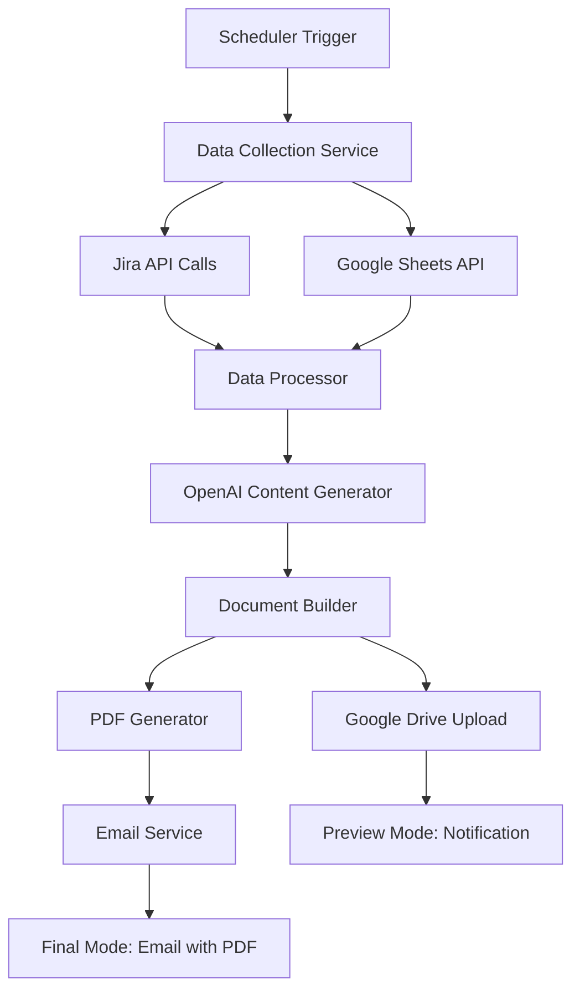

# SmarterProducts-Weekly: Architecture Plan

## Project Overview

An automated weekly reporting system that:
- **Tuesday Night**: Generates preview report for review/editing
- **Wednesday Morning**: Finalizes and emails PDF report with Google Drive link
- **Data Sources**: Multiple Jira boards, Google Sheets (specific tabs)
- **AI Integration**: OpenAI API for content generation with custom prompts
- **Output**: PDF report + Google Doc stored in Google Drive

## Architecture Options

### Option 1: Cloud-Native Serverless (Recommended)

**Stack:**
- **Runtime**: Python 3.11+ on AWS Lambda or Google Cloud Functions
- **Scheduling**: AWS EventBridge or Google Cloud Scheduler
- **Storage**: AWS S3 or Google Cloud Storage for temp files
- **Database**: DynamoDB or Firestore for state management
- **Notifications**: AWS SES or SendGrid for email delivery

**Pros:**
- Cost-effective (pay per execution)
- Auto-scaling and maintenance-free
- Excellent integration with Google Workspace
- Built-in monitoring and logging
- Easy deployment and updates

**Cons:**
- Cold start latency
- Execution time limits (15 min AWS, 60 min GCP)
- Vendor lock-in

**Architecture Flow:**
```
EventBridge/Scheduler → Lambda/Cloud Function → Data Collection → AI Processing → Document Generation → Email/Storage
```

### Option 2: Containerized Microservices

**Stack:**
- **Runtime**: Python FastAPI or Node.js Express
- **Container**: Docker + Kubernetes or Docker Compose
- **Scheduling**: Kubernetes CronJobs or external cron
- **Database**: PostgreSQL or MongoDB
- **Queue**: Redis or RabbitMQ for job processing
- **Storage**: MinIO or cloud storage

**Pros:**
- Full control over environment
- No execution time limits
- Easy local development
- Technology flexibility
- Can handle complex workflows

**Cons:**
- Higher operational overhead
- Infrastructure management required
- Higher costs for always-on services

### Option 3: Hybrid Local + Cloud

**Stack:**
- **Local Runner**: Python script with cron scheduling
- **Cloud Services**: Google Drive API, OpenAI API, email service
- **Storage**: Local file system + Google Drive
- **Database**: SQLite for local state

**Pros:**
- Simple setup and debugging
- Full control over execution
- Lower cloud costs
- Easy to modify and test

**Cons:**
- Requires always-on machine
- Single point of failure
- Manual scaling and maintenance
- Network dependency

## Recommended Technology Stack

### Core Technologies
- **Language**: Python 3.11+
- **Framework**: FastAPI (for API endpoints) + Click (for CLI)
- **Task Scheduling**: APScheduler or cloud-native schedulers
- **Document Processing**: ReportLab (PDF) + python-docx (Word)

### Data Integration
- **Jira**: `jira` Python library or REST API calls
- **Google Sheets**: `gspread` + Google Sheets API
- **Google Drive**: `google-api-python-client`
- **OpenAI**: `openai` Python library

### Infrastructure Components
- **Configuration**: Pydantic for settings management
- **Logging**: structlog for structured logging
- **Error Handling**: Sentry for error tracking
- **Secrets**: AWS Secrets Manager or Google Secret Manager

## Data Flow Architecture



## Component Breakdown

### 1. Data Collection Service
```python
class DataCollector:
    - collect_jira_data(boards: List[str]) -> Dict
    - collect_sheets_data(sheet_id: str, tabs: List[str]) -> Dict
    - validate_data(data: Dict) -> bool
```

### 2. AI Content Generator
```python
class ContentGenerator:
    - generate_summary(data: Dict, prompt_template: str) -> str
    - generate_insights(metrics: Dict) -> str
    - customize_tone(content: str, style_guide: str) -> str
```

### 3. Document Builder
```python
class DocumentBuilder:
    - create_google_doc(content: Dict) -> str  # Returns doc_id
    - generate_pdf(doc_id: str) -> bytes
    - apply_template(data: Dict, template: str) -> str
```

### 4. Notification Service
```python
class NotificationService:
    - send_preview_notification(doc_link: str) -> bool
    - send_final_report(pdf_data: bytes, doc_link: str) -> bool
```

## Configuration Structure

```yaml
# config.yaml
schedule:
  preview: "0 22 * * TUE"  # Tuesday 10 PM
  final: "0 8 * * WED"     # Wednesday 8 AM

data_sources:
  jira:
    base_url: "https://your-domain.atlassian.net"
    boards: ["PROJ-1", "PROJ-2", "PROJ-3"]
  
  google_sheets:
    sheet_id: "your-sheet-id"
    tabs: ["Weekly Metrics", "KPIs", "Issues"]

ai:
  openai_model: "gpt-4"
  prompts:
    summary: "templates/summary_prompt.txt"
    insights: "templates/insights_prompt.txt"

output:
  google_drive_folder: "Weekly Reports"
  email_recipients: ["stakeholder1@company.com"]
  template: "templates/report_template.docx"
```

## Security Considerations

### Secrets Management
- API keys stored in cloud secret managers
- Environment-specific configurations
- Encrypted data transmission

### Access Control
- Service account authentication for Google APIs
- Jira API tokens with minimal permissions
- Email service authentication

## Deployment Options

### Option A: Google Cloud Platform
```bash
# Deploy using Cloud Functions + Cloud Scheduler
gcloud functions deploy weekly-report-preview --runtime python311
gcloud functions deploy weekly-report-final --runtime python311
gcloud scheduler jobs create http preview-job --schedule="0 22 * * 2"
gcloud scheduler jobs create http final-job --schedule="0 8 * * 3"
```

### Option B: AWS
```bash
# Deploy using SAM or Serverless Framework
sam deploy --template-file template.yaml
aws events put-rule --schedule-expression "cron(0 22 ? * TUE *)"
```

### Option C: Local with Docker
```bash
# Run locally with cron scheduling
docker-compose up -d
# Cron jobs configured in container
```

## Development Phases

### Phase 1: Core Data Collection (Week 1)
- Set up project structure
- Implement Jira API integration
- Implement Google Sheets integration
- Basic data validation and processing

### Phase 2: AI Integration (Week 2)
- OpenAI API integration
- Prompt engineering and testing
- Content generation pipeline
- Template system setup

### Phase 3: Document Generation (Week 3)
- Google Docs creation
- PDF generation
- Template application
- Google Drive integration

### Phase 4: Automation & Deployment (Week 4)
- Scheduling implementation
- Email service integration
- Error handling and logging
- Deployment and testing

## Questions for Discussion

1. **Infrastructure Preference**: Which architecture option aligns best with your current infrastructure and maintenance preferences?

2. **Data Sources**: 
   - Which specific Jira boards need to be accessed?
   - What are the exact Google Sheets and tab names?
   - What specific data points should be extracted?

3. **AI Content Requirements**:
   - What tone/style should the AI-generated content have?
   - What types of insights should be generated?
   - Any specific formatting requirements?

4. **Report Format**:
   - Do you have an existing template or style guide?
   - What sections should the report include?
   - Any specific branding requirements?

5. **Error Handling**:
   - How should the system handle API failures?
   - Should there be fallback mechanisms?
   - What level of monitoring is needed?

6. **Security & Compliance**:
   - Any specific security requirements?
   - Data retention policies?
   - Audit logging needs?

## Next Steps

1. **Review Architecture Options**: Choose preferred approach
2. **Define Data Requirements**: Specify exact data sources and formats
3. **Create Prompt Templates**: Design AI content generation prompts
4. **Set Up Development Environment**: Initialize chosen tech stack
5. **Implement MVP**: Start with basic data collection and processing

---

*This document will be updated as we refine the architecture based on your feedback and requirements.*
